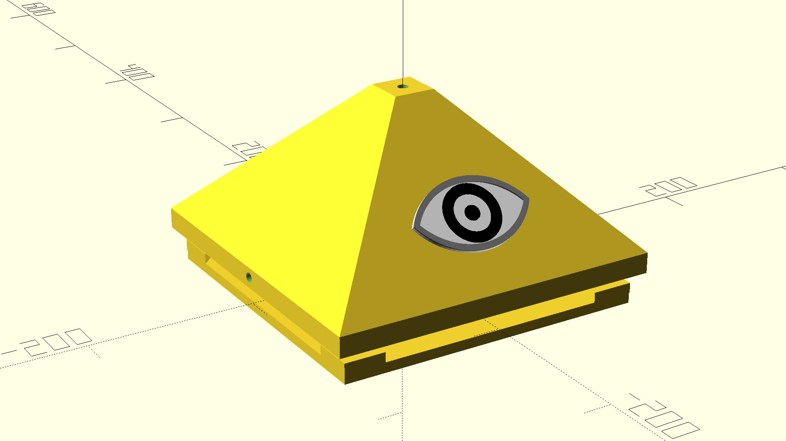
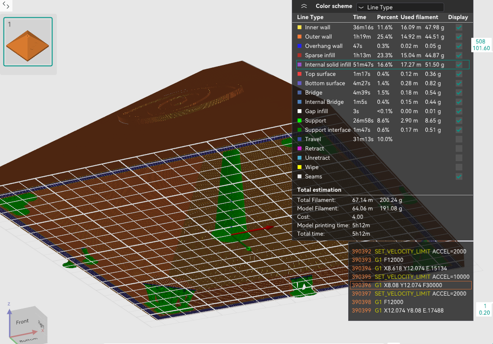

License: [](https://creativecommons.org/licenses/by-nc-nd/4.0/)

# All-Seeing-Eye Design Document


A 3d printed structure to contain broad spectrum sub-ghz meshtastic VLBI elements


## 1. Broader System Architecture

The overall system is composed of two primary node types:

* **SDR Node**

  * Performs wideband spectrum sensing
  * Handles coordination and task delegation
  * Synthesizes composite spectrum and RSSI bitmaps

* **All-Seeing Eye** Nodes (ESP32 + CC1101)

  * Perform distributed, narrowband RSSI sensing
  * Contribute localized observations to the global view

By correlating RSSI bitmaps from multiple perspectives, the system can simultaneously determine **where many RF broadcasts each originate from, in real time**. Complete spectral visibility emerges from the correlation of many limited observers.

This design document focuses on the **All-Seeing Eye Node** as a physical and conceptual artifact within this broader architecture.

This project is intended to operate as a **VLBI (Very Long Baseline Interferometry) Cluster**. While individual nodes provide utility, the core value proposition is the synchronized collaboration of multiple distributed nodes to triangulate signals and build high-fidelity spectrum maps.

To support synchronized sampling, nodes establish a shared wall-clock using **SNTP/NTP**. This time baseline enables cluster-wide coordination (e.g., aligned scan windows) and is a prerequisite for higher-order ranging and consensus behaviors.
When running spectrum scans, nodes should align on UTC boundaries and only sweep when `utc_seconds % 10 == 0` to keep samples phase-aligned across the cluster.

## 2. Regulatory & Operational Posture

**PASSIVE OBSERVATION ONLY**:
The "All-Seeing Eye" is designed exclusively as a **Passive Reception Device**. 
*   The default firmware strictly disables any transmission capabilities on the CC1101 radio to ensure compliance with local RF regulations (FCC/CE). 
*   The device listens, measures, and reports. It never transmits, jams, or interferes.
*   *Note: While the hardware supports TX, enabling it requires manual firmware modification by the user, who assumes all legal liability.*

---

## 3. Naming Decisions

* **All-Seeing Eye** — distributed RF observer

The term *All-Seeing Eye* is used **literally and technically**, describing emergent total visibility of the RF spectrum derived from correlated partial observations, not from a single privileged vantage point.

---

## 4. Physical Design Specifications (Prototype)

For the initial prototype, the enclosure must meet the following precise physical specifications to be modeled in 3D:

### 4.1 Base Geometry
*   **Structure**: A hollow square prism.
*   **Dimensions**: 8 inches x 8 inches (Outer footprint) - *Updated from 4" in v1.1*.
*   **Height**: 0.5 inches.
*   **Wall Thickness**: 0.25 inches.
*   **Notes**: This forms the foundation upon which the pyramid sits.

### 4.2 Pyramid Geometry
*   **Structure**: A hollow 4-sided pyramid sitting directly atop the base.
*   **Material Compatibility**: The shell must be printed in **Semi-Transparent** material (PETG/PLA) to allow internal LED diffuse lighting to be visible externally without physical apertures.
*   **Slope**: Faces must be angled at 45 degrees.
*   **Wall Thickness**: 0.25 inches.
*   **Front Face**: Blank (Eye Symbol is a separate attachment).
*   **Top**: Truncated flat top.
    *   The flat top accommodates a central SMA connector hole.

### 4.3 Base Plate (Bottom Lid)
*   **System**: A separate 0.25" thick plate that snaps into the bottom of the shell.
*   **Alignment**: Includes four corner alignment tabs (triangles) that fit inside the shell walls.
*   **Latching Mechanism**: Magnetic Latch System.
    *   **Magnets**: Uses 8x 6x3mm round magnets (4 in shell, 4 in lid).
    *   **Magnet Placement**: Magnets are installed in internal recesses (blind holes) so they never touch directly. There is a ~1mm plastic bridge separating them.
    *   **Shell Side**: Corner blocks inside the base rim hold magnets facing down.
    *   **Lid Side**: Alignment tabs hold magnets facing up.
    *   **Superglue**: Magnets are secured in their recesses with superglue or epoxy.

### 4.4 Clearances
*   The entire assembly is hollow.
*   Internal thickness of walls is consistent (0.25 inch).

### 4.5 Eye Symbol (Attachment)
*   **Design**: A separate visual artifact attached to the front face.
*   **Style**: Minimalist "All-Seeing Eye" (Almond shape + Pupil).
*   **Dimensions**: 3 inches wide x 1.75 inches tall.
*   **Mounting**: Adhered to the front 45-degree face.

---

## 5. Connectivity & Interface Layout

The connector ports are distributed across the faces of the **Base Prism** and the **Pyramid Top**.

### 5.1 Top Interface (Pyramid Apex)
*   **Connector**: VNA / Sensing SMA.
*   **Placement**: Centered on the flat, truncated top of the pyramid.
*   **Requirements**: Through-hole sized for standard SMA bulkhead. Clearance for cable attachment.

### 5.2 Base Interfaces
The base prism has four faces. The layout is as follows:

*   **Front Face**: 
    *   **Status**: Blank / Uninterrupted.
*   **Rear Face**:
    *   **Connector**: USB / Power.
    *   **Details**: A cutout or hole reaching the bottom edge of the base, allowing a USB cable to pass under/into the unit for power and control.
*   **Left Face**:
    *   **Connector**: 2.4GHz Wi-Fi Antenna (SMA).
    *   **Details**: Through-hole for SMA bulkhead. Ensure internal clearance for the nut and external clearance for antenna rotation.
*   **Right Face**:
    *   **Connector**: Meshtastic Node Antenna (SMA).
    *   **Details**: Through-hole for SMA bulkhead. Ensure internal clearance for the nut and external clearance for antenna rotation.

This layout separates sensing from networking both **electrically and visually**, while maximizing RF isolation within a compact enclosure.

---

## 6. Lighting Design

Lighting is used to convey **latent awareness**, not alerts or activity.

### Principles

* Dim, indirect, constant illumination
* No flashing, blinking, or RGB cycling
* Light is a side effect of perception, not a signal

### Lighting Layers

* **Eye Glow**: Internal RGB LED (ESP32) diffuses through the **semi-transparent shell material**. No physical hole is required.
* **Edge Leakage**: Subtle light escaping along seams or edges
* **Base Halo (optional)**: Soft downward glow to create a floating artifact effect

Lighting behavior is slow, restrained, and continuous, reinforcing the sense that the node is always perceiving.

---

## 7. Optional Hardware Components

While the core functionality is provided by the ESP32 and CC1101, additional modules can establish the node as a precise reference point in the VLBI network.

### GPS Module
*   **Component**: **[GY-NEO6MV2 (u-blox NEO-6M)](https://amzn.to/3NpCHRz)**
*   **Purpose**: Provides accurate geolocation and precise time-synchronization for signal timestamping.
*   **Precision**: +/- 2.5m.
*   **Integration**: Can be mounted internally on the base plate or adhered to the inner wall.

---

## 8. Geolocation Techniques

This section details methods for determining the positions of dispersed nodes.

### 8.0 Geolocation Core Service (Planned)
The firmware will maintain a core geolocation service that fuses evidence over time (GPS, WiFi, BLE, RF, mesh) into a single estimate. The service exposes a summarized `geolocation` block via `/api/status`, including confidence, fix type (absolute/relative), motion state, and last-updated time. This is the anchor point that BLE ranging and other sensors will feed into.

### 8.1 Native Approach (No GPS)
This method utilizes the core ESP32+CC1101 hardware to estimate location without dedicated GPS modules. It relies on a "Spring-Mass" or "Elastic Map" concept.

**1. Relative Positioning (Multidimensional Scaling)**
*   **Concept**: Every node broadcasts packets to every other node to measure pairwise RSSI (Signal Strength).
*   **Processing**: These values are fed into a **Multidimensional Scaling (MDS)** algorithm. The algorithm treats RSSI values as "springs" (distances) and unfolds the graph to find the geometric shape that best satisfies the signal constraints.
*   **Result**: A relative 2D map of where nodes are sitting relative to each other (e.g., "Node A is 5 meters left of Node B").
*   **Accuracy**: ~3–10 meters relative precision.

**2. Absolute Anchoring (WiFi Fingerprinting)**
*   **Concept**: To pin this floating relative map to the real world, ESP32s scan for all nearby WiFi Access Point BSSIDs.
*   **Processing**: This data is resolved via Geolocation APIs (e.g., Google/Mozilla) to approximate latitude/longitude.
*   **Result**: Provides an absolute "anchor" for the cluster.
*   **Accuracy**: ~15–30 meters.

**Caveats**: 
*   This approach is essentially an estimation.
*   RSSI is easily distorted by obstacles (multipath fading), which can warp the calculated geometry.
*   WiFi geolocation depends entirely on the density of known networks in the area.

### 8.2 Precision Approach (GPS)
The preferred alternative is installing the optional **GY-NEO6MV2 GPS Module** (see Section 6).
*   **Accuracy**: +/- 2.5m (Absolute).
*   **Reliability**: Independent of WiFi availability and unaffected by RF multipath distortion.

### 8.3 Role of the Single RTL-SDR
While a single RTL-SDR node cannot perform Time Difference of Arrival (TDOA) multilateration (which requires 3+ synchronized anchors), it plays a support role:
*   **Calibration**: Use the SDR to monitor transmission power of the nodes, normalizing "hot" transmitters that would otherwise skew RSSI distance calculations.
*   **Pseudo-Doppler (Advanced)**: With a custom antenna-switching add-on, the single SDR can perform Direction Finding to determine the Angle of Arrival (AoA), adding bearing lines to the location solution.

---

### 8.4 VLBI / TDOA Possibilities (Future Scope)
While the current prototype focuses on RSSI, the project name "All-Seeing Eye" references **VLBI (Very Long Baseline Interferometry)** concepts.

*   **TDOA Viability**: Time Difference of Arrival (TDOA) requires extremely precise nanosecond-level clock synchronization across nodes.
    *   **ESP32 Limitations**: The standard ESP32 clock is not stable enough for fine-grained TDOA on its own.
    *   **Non-Coherent Operation**: Since the nodes are not phase-coherent (they don't share a local oscillator), standard interferometry is impossible.
*   **Large Baseline Approach**: If nodes are separated by significant distances (kilometers), the timing requirements relax slightly for macroscopic TDOA.
    *   **GPS PPS**: Adding the **GPS Module (Section 6)** provides a **Pulse Per Second (PPS)** signal. This can discipline the local clocks to within microsecond accuracy.
    *   **Feasibility**: With GPS-disciplined timestamps, TDOA could potentially resolve location to within ~300 meters (1 microsecond = ~300m light travel time). This allows for "City-Scale" triangulation of powerful signal sources, staying true to the VLBI inspiration despite the lack of phase coherence.

### 8.5 Mesh-Assisted Localization (Opportunistic)
If the node is operating within an active Meshtastic mesh, it can utilize traffic from *other* nodes to determine its own location.

*   **Mechanism**: The node listens for position packets from nearby Meshtastic nodes that *do* have GPS fixes.
*   **Calculation**: By measuring the RSSI of the incoming packet and extracting the GPS coordinates from the payload, the node treats the sender as a "Beacon" or "Anchor".
*   **Trilateration**: With signals from 3+ distinct GPS-enabled peers, the node can estimate its position based on expected signal fade (Path Loss Models).
*   **Single-Hop Constraint**: This technique relies on **direct (single-hop)** reception. Use of RSSI from relayed packets would result in calculating distance to the repeater, not the original sender, leading to gross errors. The system must verify the packet has not been hopped before using it for ranging.

### 8.6 BLE Ranging & Live Topology Consensus
To complement RF triangulation, newer iterations of the system employ BLE (Bluetooth Low Energy) for high-resolution proximity detection within the cluster itself.

*   **Stationarity Detection**: By constantly monitoring the RSSI of known peers over BLE, the cluster can detect if the configuration is static or in motion. Stable RSSI values over N minutes imply a stationary deployment, triggering higher-precision, longer-integration RF tasks.
*   **Short-Range Ranging (<20m)**: Standard WiFi/Sub-GHz RSSI is noisy. BLE advertising provides a separate, dedicated channel for "Ranging Beacons".
    *   **Consensus**: If Node A sees Node B at -40dBm and Node C at -85dBm, and Node B sees Node C at -70dBm, the cluster can solve for the relative geometry of the triangle {A,B,C}.
*   **Implementation**: This runs as a background task (`SystemIdlePlugin`) on the ESP32 core, independent of the CC1101 radio, ensuring it does not interrupt long-range spectral monitoring.

---

## 9. Overall Intent

The All-Seeing Eye Node is designed as:

* a sensing instrument
* a symbolic artifact
* a field-deployable system component

The system observes **broadcast signals, not people**. Power derives from distribution, correlation, and persistence rather than authority or control.

The object is meant to feel present, inevitable, and quietly capable — something you notice after it has already been there.

---

## 10. Locked Concepts

* **Names**: SDR Node, All-Seeing Eye Node, All-Seeing Eye View
* **Form**: Pyramidal structure on a raised square base.
* **Function**: Distributed RF visibility through correlated RSSI sensing
* **Aesthetic**: Ominous, restrained, archetypal, intentional

---

## 11. Fabrication & Build Pipeline

The physical enclosure is designed programmatically using **OpenSCAD**. This ensures that all dimensions, clearances, and tolerances can be adjusted parametrically and versioned as code.

### Prerequisites
*   **OpenSCAD**: Download and install from [openscad.org](https://openscad.org/).

### Shopping List
* Sparkly semi-transparent purple PLA filament ([$19.99](https://amzn.to/3Yy0ZLC))
* I used an AD5M Pro 3D printer which is 10/10. Fully enclosed and filtered. 220x220x250mm build volume. Very easy to use. ([$379](https://amzn.to/4aUHjsQ))
* ESP-32 3-pack with IPX MHF1 connector ([$17.99](https://amzn.to/3YyJqLl))
* CC1101 module 3-pack ([$22.99](https://amzn.to/4qEJl4S))
* IPX MHF1 to SMA Cable 5-pack ([$8.29](https://amzn.to/3NbLDdm))
* Jumper wires (male-female) (there are infinite options here but there are what i used) ([$6.98](https://amzn.to/4qsRIkg))
* Heltec v3 Meshtastic Node (optional, any meshtastic node with IPX MHF1 connector will do) ([$21.99](https://amzn.to/49MXC9Y))
* GY-NEO6MV2 GPS Module (optional) ([$9.99](https://amzn.to/3NpCHRz))
* 2.4ghz wifi antenna 4-pack (optional, any wifi antenna with SMA connector will do) ([$8.69](https://amzn.to/4szIt3d))
* 915mhz antenna 2-pack (optional, any 915mhz antenna with SMA connector will do) ([$9.99](https://amzn.to/3LGUaV7))
* SMA Extensions 2-pack (optional, but its going to hard to fit everything without these [$6.99](https://amzn.to/45Ou0Xd))
* Self-advesive breadboard (optional) [$8.99](https://amzn.to/49mhwbJ)


### Source Files
*   Design files are located in the `3d models/design/` directory.

#### Core Files
*   **Shell (Blank)**: `3d models/design/all-seeing-eye.1.6.scad` (Magnetic Latch System, Blank Face).
*   **Base Plate**: `3d models/design/base-plate.1.0.scad` (Matching Magnetic Lid).
*   **Eye Symbol**: `3d models/design/eye-symbol.1.0.scad` (Separate print).

#### Combined Variants
*   **Combined Shell**: `3d models/design/combined-1.1.scad` (Shell + Eye formed as one piece. **Includes transparency cutout** behind the eye for LED visibility).

#### Visualization
*   **Assembly**: `3d models/design/assembly.1.0.scad` (Visualization only).

### Printing Strategies
You can choose between two assembly methods:

1.  **Combined Print (Recommended)**: 
    *   Print `combined-1.1.stl` and `base-plate.1.0.stl`.
    *   This provides a robust, single-piece shell with the eye symbol pre-integrated and optimized for transparency.
2.  **Separate Parts**:
    *   Print `all-seeing-eye.1.6.stl` (Blank Shell), `eye-symbol.1.0.stl`, and `base-plate.1.0.stl`.
    *   Glue the eye symbol onto the front face manually.
    *   *Note*: This method does not have the transparency cutout behind the eye, so the LED glow may be dimmer.

### Generating 3D Printable Files (STL)
To generate the STL files for printing:

1.  Run the automated build script:
    ```cmd
    cd "3d models"
    .\build.bat
    ```
2.  The script will automatically detect OpenSCAD and compile all versions found in the `design/` folder.
3.  Output STL files will be placed in the `build/` directory.

### Print Preview & Estimates


(Note: Estimates below are approximate place holders based on 15% infill and standard PLA settings with tree support).

*   **Print Time**: 4 hours, 45 minutes
*   **Material Usage**: ~157.75g
*   **Material Cost**: ~$3.15 (at $19.99/kg)

---

## 12. Wiring Guide (ESP32-S3 N16R8)

The system uses an **ESP32-S3-WROOM-1 N16R8** development board. This board has a different pinout than the classic ESP32.

The recommended wiring uses the **Left Header** almost exclusively to keep cabling tidy, and because thats all you can access in a standard breadboard with a package this size. It utilizes the default hardware SPI pins for the S3 (FSPI).

| CC1101 Pin | Pin Name | Function | ESP32-S3 Pin | Location on Board |
| :--- | :--- | :--- | :--- | :--- |
| 1 | **GND** | Ground | **GND** | Bottom Left (G) |
| 2 | **VCC** | Power (3.3V) | **3V3** | Top Left (Pin 1 or 2) |
| 3 | **GDO0** | Interrupt (Differs from v1) | **GPIO 4** | Left Side (Top) |
| 4 | **CSN** | Chip Select | **GPIO 10** | Left Side (Middle, marked FSPICS0) |
| 5 | **SCK** | SPI Clock | **GPIO 12** | Left Side (Middle, marked FSPICLK) |
| 6 | **MOSI** | Master Out | **GPIO 11** | Left Side (Middle, marked FSPIIO5) |
| 7 | **MISO** | Master In | **GPIO 13** | Left Side (Middle) |
| 8 | **GDO2** | Interrupt 2 (Optional) | **GPIO 5** | Left Side (Top) |

### Additional Hardware Notes
*   **Onboard RGB LED**: The built-in status LED on this specific board is on **GPIO 47** (or 48 on some variants).
*   **Power & Programming**: 
    *   **Right Port (UART)**: Use this for standard programming and serial monitoring. It runs through the onboard CH343P chip for a reliable connection.
    *   **Left Port (USB)**: This is the native ESP32-S3 USB (OTG) port. It can power the board, but is used for advanced USB device emulation.
*   **Antennae**: Ensure the CC1101 antenna is connected before powering on the device to avoid damage to the PA (Power Amplifier).

---

## 13. Version History & Development Log

This section documents the iterative design process from initial concept to the current printable shell.

### Current Version: v1.6 (Magnetic System)
*   **Status**: Ready for Print.
*   **Description**: Full magnetic latching enclosure system.
*   **Components**:
    1.  **Shell (v1.6)**: Added internal corner blocks with blind holes for 6x3mm magnets.
    2.  **Base Plate (v1.0)**: New bottom lid with alignment tabs and matching magnet recesses.
    3.  **Eye Symbol (v1.0)**: Separate "Vesica Piscis" style eye attachment.
    4.  **Combined Variant (v1.0)**: Alternate shell model with the Eye Symbol already fused to the front face (single print).
*   **Material**: Shell MUST be printed in **Semi-Transparent** material for checking internal status LEDs without opening.

### Development Milestones

*   **v1.5**: Clean Shell.
    *   Reverted complex internals to validate form factor.
    *   8-inch base, 45-degree slope.

*   **v1.3 - v1.4**: Internal Mounting Experiments (Deprecated).
    *   Analyzed ESP32-S3-WROOM-1-N16R8 dimensions via photos.
    *   Measured LED alignment offsets (-6mm X, +18mm Y) to center the LED on the pyramid face.
    *   Designed candidate internal brackets for "flush face" mounting.
    *   *Decision*: Complexity of supporting floating internal rails was high; reverted to clean shell (v1.5) to ensure printability first.

*   **v1.2**: Geometry Fixes.
    *   Identified and fixed a bug where the internal hollow void was cutting completely through the roof.
    *   Adjusted the inner pyramid height to leave a solid 0.25" roof for the top SMA connector.

*   **v1.1**: Scaling Up.
    *   Increased base size to 8 inches to accommodate larger internal volume requirements.
    
*   **v1.0**: Initial Parametric Design.
    *   Established the OpenSCAD codebase.
    *   Defined the core "Base + Pyramid" geometry.
    *   Initial size: 4-inch base.

### Hardware Research (ESP32-S3)
*   **Device**: ESP32-S3-WROOM-1-N16R8 Dev Board.
*   **Dimensions**: 58mm x 28mm (PCB footprint).
*   **LED Position**: The RGB LED is offset from the center.
    *   **X-Offset**: ~6mm left of PCB center.
    *   **Y-Position**: ~18mm from the USB edge.
*   **Future Integration**: Future enclosure revisions will incorporate a mounting sled or clip that aligns this specific LED location with a window in the pyramid face.

